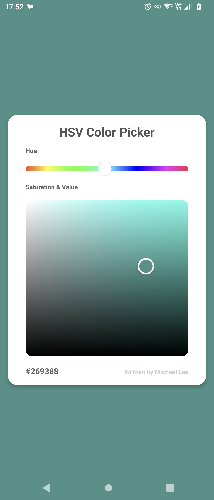

# Color Picker


This is a simple color picker used to select a color from the HSV color space.

## Some Knowledge

HSV color space is a cylindrical color space. It is a 3D space, and the three dimensions are Hue, Saturation, and Value.

Hue is the color, Saturation is the intensity of the color, and Value is the brightness of the color.

Hue is from 0 to 360, and Saturation and Value are from 0f to 1f.

This is a different color space from RGB color, but HSV color can be converted to RGB color and vice versa.

## Screenshots

You can see the code in the 'app' module. That's a demo.



## How to use

1. implement this package from `jitpack.io`

```groovy
repositories {
    maven { url 'https://jitpack.io' }
}
// see the latest version on the badge that the top of this document
implementation 'com.github.michaellee123:ColorPicker:latest_version'
```

2. add a ColorHuePicker to your layout

```xml
<dog.abcd.colorpicker.ColorHuePicker
    android:id="@+id/huePicker"
    android:layout_width="match_parent"
    android:layout_height="30dp" />
```

3. add a ColorSVPicker to your layout

```xml
<dog.abcd.colorpicker.ColorSVPicker
    android:id="@+id/svPicker"
    android:layout_width="match_parent"
    android:layout_height="340dp" />
```

4. set the UI style in your code, you can change everything you want, after you set the style, please call `invalidate()` to refresh the UI

```kotlin
huePicker.pickerSize = resources.displayMetrics.density * 15 // set the size of the picker, the padding will be the same as this value, this value is a pixel value
huePicker.hueHeight = resources.displayMetrics.density * 10// set the height of the hue bar, this value is a pixel value
huePicker.round = resources.displayMetrics.density * 5// set the round of the hue bar, this value is a pixel value
huePicker.maxHue = 310 //default is 359, 'cause 360 is the same as 0
huePicker.postInvalidate()// refresh the UI
svPicker.pickerSize = resources.displayMetrics.density * 18// set the size of the picker, the padding will be the same as this value, this value is a pixel value
svPicker.round = resources.displayMetrics.density * 12// set the round of the color panel, this value is a pixel value
svPicker.postInvalidate()// refresh the UI
// other values can be set, please see the source code
```

5. set the color listener to get the color you selected

```kotlin
huePicker.onHueChange { hue, byUser, done ->
    // if you wanna submit the color, maybe you need to check both the 'byUser' and the 'done' flag
    svPicker.setColorH(hue)// the ColorSVPicker's hue value should always be set to this hue value. 
}
svPicker.onColorPick { color, byUser, done ->
    // if you wanna submit the color, maybe you need to check both the 'byUser' and the 'done' flag
    // the 'color' is an Int value, you can use 'HSVColor' to get the HSV value or the RGB hex string value.
    val hsvColor = HSVColor.valueOf(color)
    // the toString() method of HSVColor will return the hex string of the color
    Log.d("ColorPicker", hsvColor.toString())
}
```

6. sometimes you may need to set a default color, here is an example

```kotlin
val color = HSVColor.parseColor("#762ddf")
huePicker.setColorH(color.h)
svPicker.setColor(color.color)
// ColorSVPicker also has a method to set the hue value, but here needn't call it, 'cause the 'setColor' is called at the end by 'setColorH' itself.
```

PS: this package does not provide XML attributes, you can only set the UI style in your code.

## License

None License, you can use or edit it in any way you want.